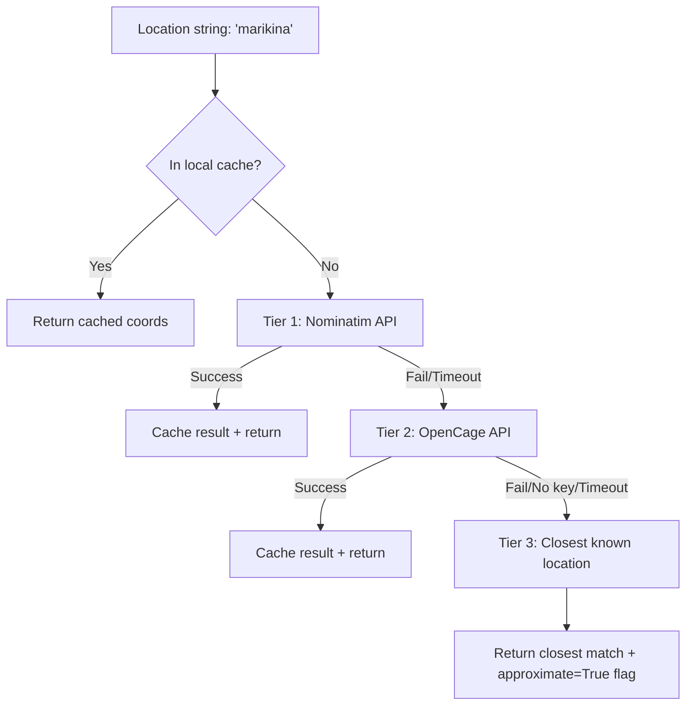

# Intent Parser + Philippine Geocoding Module

## Context

The repo is currently empty (only `idea.txt`, `README.md`, and a plan file). This will be the first real code. The existing plan calls for a single `app.py` Flask file, but per the user's request we are splitting intent parsing into its own module for clean separation of concerns.

## Module: `intent_parser.py`

A Flask Blueprint (or standalone helper) that exposes a `parse_intent(raw_text) -> dict` function and a geocoding layer. The Flask app (`app.py`) will import and use it.

### Input / Output

- **Input**: Raw SMS body string, e.g. `"FLOOD Marikina"` or `"FLOOD Brgy Lahug, Cebu City"`
- **Output**: A dict like:

```python
{
    "action": "flood",
    "location": "marikina",
    "coordinates": {"lat": 14.6507, "lon": 121.1029}
}
```

### Parsing Logic

1. Normalize input: lowercase, strip whitespace
2. Extract action keyword (first token): `flood`, `status`, `start`, `loc`, etc.
3. Extract location (everything after the action keyword)
4. Clean location string: strip "city", "brgy", "barangay" prefixes/suffixes, normalize commas
5. Pass cleaned location to the geocoding layer
6. Return structured dict

---

## Geocoding Strategy: 3-Tier Fallback Chain (Never Fails)

The user needs coordinates for **every city (~~146) and every barangay (~~42,000)** in the Philippines. The system uses a strict fallback chain -- if one tier fails, it moves to the next. It **always returns coordinates**.




### Local Cache Layer (checked before any API call)

- File: `locations_cache.json` -- auto-growing dict of `{location_name: {lat, lon}}`
- Pre-seeded with ~10 flood-prone PH cities from the existing plan
- Every successful API geocode is written back to cache
- Cache is checked first on every call -- zero latency, zero cost for repeat lookups

### Tier 1 (Primary): Nominatim -- OpenStreetMap Geocoder

- **URL**: `https://nominatim.openstreetmap.org/search`
- **Cost**: Free, no API key needed
- **Coverage**: Good for PH cities, decent for barangays (OSM has an active PH mapping community)
- **Rate limit**: 1 request/second (fine for SMS volume)
- **Call**: `GET /search?q=Marikina,Philippines&format=json&limit=1&countrycodes=ph`
- **Timeout**: 5 seconds
- **Why primary**: Zero setup, zero cost, works immediately out of the box

### Tier 2 (Backup): OpenCage Geocoder

- **URL**: `https://api.opencagedata.com/geocode/v1/json`
- **Cost**: Free tier = 2,500 requests/day, no credit card required
- **Coverage**: Wraps Nominatim + other data sources, often better accuracy for obscure barangays
- **Requires**: `OPENCAGE_API_KEY` in `.env` (if key not set, this tier is skipped)
- **Timeout**: 5 seconds
- **Why backup**: Catches locations Nominatim misses; adds confidence scores

### Tier 3 (Final Fallback): Closest Known Location

When both APIs fail (down, timeout, or no results), the system **never returns nothing**. Instead:

1. **Fuzzy string match** the input against all keys in the cache using `difflib.get_close_matches()`
2. If a close name match is found (e.g. "marikna" -> "marikina"), return its coordinates
3. If no name match, fall back to **Manila** (14.5995, 120.9842) as the absolute default
4. The returned dict includes an `approximate: True` flag so the caller can warn the user:
  - "We couldn't find [X] exactly. Showing results for [closest match] instead."

This guarantees the system **always returns coordinates** -- it degrades gracefully, never errors out.

### Supporting API -- PSGC Cloud (name validation, no coordinates)

- **URL**: `https://psgc.cloud/api/`
- **Cost**: Free, no key
- **Use case**: Validate that a city/barangay name exists in the Philippines, fuzzy match names
- **Does NOT provide lat/lon** -- only names and PSGC codes
- Can optionally improve the fuzzy matching in Tier 3

---

## Proposed File Structure

```
scaling-octo-eureka/
├── app.py                  # Flask entry point, /sms webhook route
├── intent_parser.py        # parse_intent() -- action + location extraction
├── geocoder.py             # get_coordinates() -- tiered Nominatim + cache
├── locations_cache.json    # Auto-growing cache of resolved coordinates
├── requirements.txt        # flask, requests, python-dotenv
├── .env.example            # TWILIO_ACCOUNT_SID, TWILIO_AUTH_TOKEN, OPENCAGE_API_KEY (optional)
└── README.md               # Updated with file structure + how geocoding works
```

---

## Key Code Sketch

### `intent_parser.py`

```python
KNOWN_ACTIONS = {"flood", "status", "start", "loc", "stop", "why"}

def parse_intent(raw_text: str) -> dict:
    tokens = raw_text.strip().lower().split(None, 1)
    action = tokens[0] if tokens else ""
    location_raw = tokens[1] if len(tokens) > 1 else ""

    if action not in KNOWN_ACTIONS:
        # Treat entire text as location, default action to "flood"
        location_raw = raw_text.strip().lower()
        action = "flood"

    location_clean = normalize_location(location_raw)
    coords = get_coordinates(location_clean)  # from geocoder.py

    return {
        "action": action,
        "location": location_clean,
        "coordinates": coords,  # {"lat": ..., "lon": ...} or None
    }
```

### `geocoder.py`

```python
def get_coordinates(location: str) -> dict:
    """Always returns coordinates. Never returns None."""

    # 0. Check local cache first (instant, free)
    cached = lookup_cache(location)
    if cached:
        return {"lat": cached["lat"], "lon": cached["lon"], "source": "cache", "approximate": False}

    # 1. PRIMARY: Nominatim (free, no key)
    coords = nominatim_geocode(location)
    if coords:
        save_to_cache(location, coords)
        return {**coords, "source": "nominatim", "approximate": False}

    # 2. BACKUP: OpenCage (free tier, needs key in .env)
    if os.getenv("OPENCAGE_API_KEY"):
        coords = opencage_geocode(location)
        if coords:
            save_to_cache(location, coords)
            return {**coords, "source": "opencage", "approximate": False}

    # 3. FINAL FALLBACK: closest known location from cache
    closest = find_closest_match(location)  # difflib fuzzy match against cache keys
    return {
        "lat": closest["lat"], "lon": closest["lon"],
        "source": "fallback", "approximate": True,
        "matched_to": closest["name"],
    }
```

---

## API Comparison Summary

- **Nominatim (PRIMARY)** -- Free, no key, 1 req/sec, good PH coverage. Zero setup.
- **OpenCage (BACKUP)** -- Free 2,500/day, needs key, better accuracy. Catches Nominatim misses.
- **Closest-match fallback (TIER 3)** -- Uses `difflib` fuzzy match against seeded cache. Always succeeds.
- **PSGC Cloud** -- Free, no key, name/code validation only (no lat/lon). Optional for name validation.
- Google Geocoding, Mapbox -- Not needed. Higher cost/complexity for no benefit at this scale.

