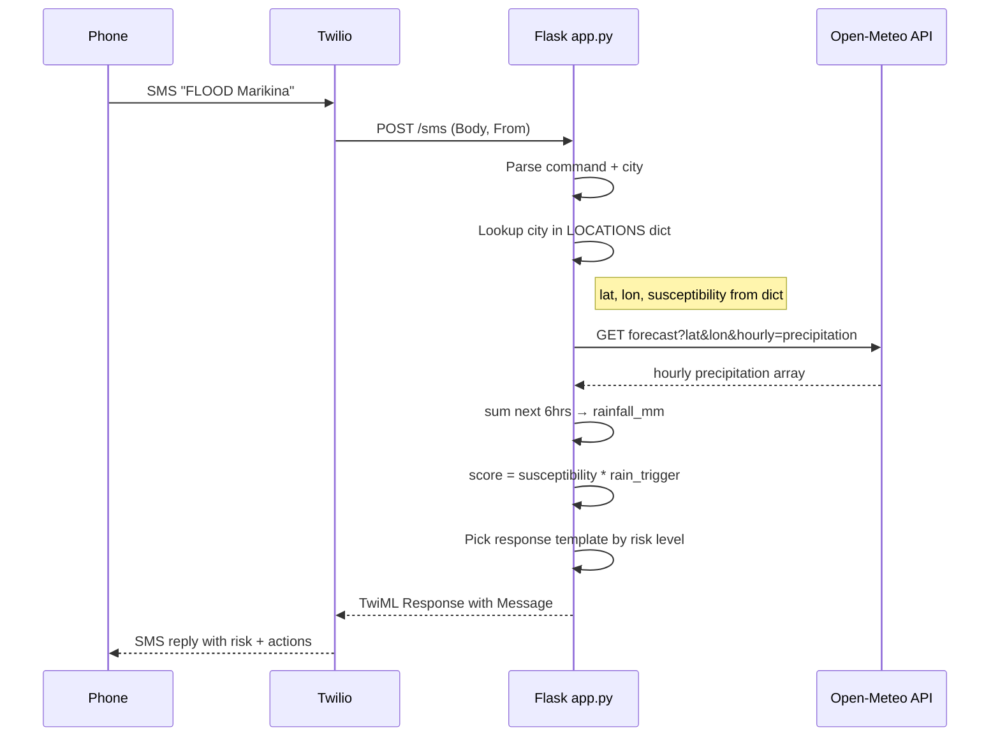

# SMS Flood Risk Assistant — 2-Hour Hackathon Plan (Merged)

## Design Principles

1. **One file first.** Everything lives in `app.py` until it doesn't fit. Split only if it exceeds ~200 lines.
2. **Hardcode what you can, fetch what you must.** Location coords and susceptibility are a dict; rainfall is the one live API call (Open-Meteo, free, no key).
3. **Stateless.** No database, no registration. Each SMS is self-contained.
4. **Demo-first.** Every decision optimizes for "does this look good in a 2-minute screen recording?"

---

## Scope

**In scope**

- `FLOOD <city>` — single command; returns risk level + action steps via SMS.
- `STATUS` — re-checks the same default/last-known city (optional second command; trivial to add).
- Hardcoded dict of ~10 flood-prone PH locations with lat/lon and susceptibility (1–4 scale).
- Live Open-Meteo call for hourly precipitation; compute 6hr rainfall total.
- Multiplicative risk model: `score = susceptibility * rainfall_trigger` → SAFE / WARNING / CRITICAL.
- Rich SMS reply with risk indicator, forecast summary, and 3–5 action steps.
- Real Twilio number + ngrok for the demo.

**Out of scope**

- Database / user registration / menu system / onboarding flow.
- Broadcast alerts / cron jobs.
- Any front-end UI.
- Live GeoRisk ArcGIS calls (hardcoded instead; mention as "production upgrade" in presentation).
- Live Nominatim geocoding (hardcoded instead; optional fallback if time permits).

---

## Architecture




---

## Implementation Steps

### Step 1 — Scaffold (10 min)

Create the project inside `scaling-octo-eureka/`:

`**requirements.txt**`

```
flask
twilio
requests
python-dotenv
```

`**.env.example**`

```
TWILIO_ACCOUNT_SID=your_sid
TWILIO_AUTH_TOKEN=your_token
```

`**app.py**` — empty Flask app with a single `POST /sms` route that returns a stub TwiML response.

```python
from flask import Flask, request
app = Flask(__name__)

@app.route("/sms", methods=["POST"])
def sms():
    body = request.form.get("Body", "").strip()
    # ... will fill in
    return "<Response><Message>Echo: " + body + "</Message></Response>", 200, {"Content-Type": "text/xml"}
```

Verify: `flask run` + `curl -X POST -d "Body=hello" http://localhost:5000/sms` returns TwiML.

---

### Step 2 — Location dict (10 min)

Hardcode ~10 flood-prone Philippine locations. Each entry has `lat`, `lon`, and `susceptibility` (1=Low, 2=Medium, 3=High, 4=Very High). These are curated from real GeoRisk/MGB data.

```python
LOCATIONS = {
    "marikina":       {"lat": 14.6507, "lon": 121.1029, "susceptibility": 4, "label": "Marikina City"},
    "manila":         {"lat": 14.5995, "lon": 120.9842, "susceptibility": 3, "label": "Manila"},
    "cebu":           {"lat": 10.3157, "lon": 123.8854, "susceptibility": 2, "label": "Cebu City"},
    "davao":          {"lat": 7.1907,  "lon": 125.4553, "susceptibility": 2, "label": "Davao City"},
    "cagayan de oro": {"lat": 8.4542,  "lon": 124.6319, "susceptibility": 3, "label": "Cagayan de Oro"},
    "legazpi":        {"lat": 13.1391, "lon": 123.7438, "susceptibility": 3, "label": "Legazpi City"},
    "tacloban":       {"lat": 11.2543, "lon": 124.9600, "susceptibility": 4, "label": "Tacloban City"},
    "iloilo":         {"lat": 10.7202, "lon": 122.5621, "susceptibility": 2, "label": "Iloilo City"},
    "zamboanga":      {"lat": 6.9214,  "lon": 122.0790, "susceptibility": 2, "label": "Zamboanga City"},
    "butuan":         {"lat": 8.9475,  "lon": 125.5406, "susceptibility": 3, "label": "Butuan City"},
}
```

**Parsing**: normalize input — lowercase, strip "city", strip "brgy"/"barangay" prefix — and fuzzy-match against dict keys (simple `in` check or startswith is enough for the demo).

**Optional fallback** (if time): if city not in dict, call Nominatim to geocode and default susceptibility to 2 (Medium).

---

### Step 3 — Open-Meteo forecast client (15 min)

Single function that takes `(lat, lon)` and returns `rainfall_6h_mm` (float).

```python
import requests
from datetime import datetime, timezone

def get_rainfall_6h(lat, lon):
    url = "https://api.open-meteo.com/v1/forecast"
    params = {
        "latitude": lat,
        "longitude": lon,
        "hourly": "precipitation",
        "forecast_hours": 12,
        "timezone": "Asia/Manila",
    }
    resp = requests.get(url, params=params, timeout=10)
    data = resp.json()
    hourly = data["hourly"]["precipitation"]
    # sum first 6 entries (next 6 hours)
    return sum(hourly[:6])
```

Edge case: if Open-Meteo is down, catch exception and return 0 with a note "(forecast unavailable)" in the reply. The demo still runs — it just shows susceptibility-only risk.

---

### Step 4 — Risk engine (15 min)

Multiplicative model, easy to explain on a slide.

```python
def classify_rain(mm_6h):
    """Map 6hr rainfall to a trigger level 0-3."""
    if mm_6h < 7.5:
        return 0, "Light"
    elif mm_6h < 15:
        return 1, "Moderate"
    elif mm_6h < 30:
        return 2, "Heavy"
    else:
        return 3, "Intense"

def compute_risk(susceptibility, rain_trigger):
    """
    score = susceptibility (1-4) * rain_trigger (0-3)
    0       → SAFE
    1-3     → WATCH
    4-6     → WARNING
    7+      → CRITICAL
    """
    score = susceptibility * rain_trigger
    if score == 0:
        return "SAFE", "No immediate flood risk."
    elif score <= 3:
        return "WATCH", "Low flood risk. Stay alert."
    elif score <= 6:
        return "WARNING", "Moderate flood risk. Prepare now."
    else:
        return "CRITICAL", "High flood risk. Act immediately."
```

This gives 4 tiers and naturally biases toward danger for high-susceptibility areas (a susceptibility-4 area only needs "Moderate" rain to hit WARNING, and "Heavy" rain to hit CRITICAL).

---

### Step 5 — Response builder (15 min)

Templates keyed by risk level. Each fits in 1-2 SMS segments (~300 chars).

```python
TEMPLATES = {
    "CRITICAL": (
        "🔴 FLOOD CRITICAL | {city}\n"
        "Forecast: {rain_label} ({rain_mm:.0f}mm) in next 6hrs\n"
        "Flood susceptibility: {suscept_label}\n\n"
        "ACTIONS:\n"
        "1. EVACUATE to higher ground NOW\n"
        "2. Bring IDs, meds, water, phone\n"
        "3. Turn off main power before leaving\n"
        "4. Do NOT cross floodwater\n"
        "5. Text FLOOD {city_key} for updates"
    ),
    "WARNING": (
        "🟡 FLOOD WARNING | {city}\n"
        "Forecast: {rain_label} ({rain_mm:.0f}mm) in next 6hrs\n"
        "Susceptibility: {suscept_label}\n\n"
        "PREPARE:\n"
        "1. Charge phone and powerbank\n"
        "2. Move valuables to higher ground\n"
        "3. Pack go-bag (IDs, meds, water)\n"
        "4. Monitor for rising water"
    ),
    "WATCH": (
        "🟢 FLOOD WATCH | {city}\n"
        "Forecast: {rain_label} ({rain_mm:.0f}mm) in next 6hrs\n"
        "Susceptibility: {suscept_label}\n\n"
        "Stay alert. No action needed yet.\n"
        "Text FLOOD {city_key} anytime to recheck."
    ),
    "SAFE": (
        "✅ SAFE | {city}\n"
        "Forecast: {rain_label} ({rain_mm:.0f}mm) in next 6hrs\n"
        "Susceptibility: {suscept_label}\n\n"
        "No flood risk right now.\n"
        "Text FLOOD {city_key} anytime to recheck."
    ),
}

SUSCEPT_LABELS = {1: "Low", 2: "Medium", 3: "High", 4: "Very High"}
```

---

### Step 6 — Wire it all together in the webhook (15 min)

In `app.py`, the `/sms` route:

1. Parse `Body`: expect `FLOOD <city>` (or just `<city>`). Lowercase, strip.
2. Look up city in `LOCATIONS`. If not found → reply "City not recognized. Try: Marikina, Manila, Cebu, Davao..."
3. Call `get_rainfall_6h(lat, lon)`.
4. `classify_rain(rainfall)` → `(rain_trigger, rain_label)`.
5. `compute_risk(susceptibility, rain_trigger)` → `(level, description)`.
6. Format template with city name, rain_mm, rain_label, susceptibility label.
7. Return TwiML: `<Response><Message>{formatted_text}</Message></Response>`.

Add logging (plain `print` statements) so the terminal shows each step during the demo:

```
[SMS] From: +639171234567 | Body: FLOOD Marikina
[LOC] Marikina City | lat=14.6507, lon=121.1029 | susceptibility=4 (Very High)
[RAIN] Open-Meteo: 72.3mm in next 6hrs → Intense (trigger=3)
[RISK] score=12 → CRITICAL
[REPLY] 🔴 FLOOD CRITICAL | Marikina City ...
```

This log output is what you show in the terminal side of the demo video.

---

### Step 7 — Test and demo (20 min)

1. **Local test**: `flask run` + `curl -X POST -d "Body=FLOOD Marikina" http://localhost:5000/sms` — verify XML response.
2. **ngrok**: `ngrok http 5000` — copy the HTTPS URL.
3. **Twilio**: Set the phone number's incoming message webhook to `https://<ngrok-id>.ngrok.io/sms`.
4. **Real SMS**: Text `FLOOD Marikina` from your phone. Screen-record the reply arriving.
5. **Demo video**: (a) phone screen with SMS conversation, (b) terminal showing the log output per request, (c) optional: quick cut to the code showing the risk table.

---

## File Layout

```
scaling-octo-eureka/
├── app.py              # Everything: Flask route, location dict, Open-Meteo client,
│                       #   risk engine, response builder, logging
├── requirements.txt    # flask, twilio, requests, python-dotenv
├── .env.example        # TWILIO_ACCOUNT_SID, TWILIO_AUTH_TOKEN
└── README.md           # Setup instructions, curl test command, demo notes
```

If `app.py` grows past ~200 lines, split into:

```
scaling-octo-eureka/
├── app.py              # Flask route + wiring
├── locations.py        # LOCATIONS dict
├── weather.py          # get_rainfall_6h()
├── risk.py             # classify_rain(), compute_risk(), TEMPLATES
├── requirements.txt
├── .env.example
└── README.md
```

---

## Risk Model Summary (for presentation slide)

```
score = susceptibility × rainfall_trigger

        │ Light(0) │ Moderate(1) │ Heavy(2) │ Intense(3)
────────┼──────────┼─────────────┼──────────┼───────────
Low(1)  │ SAFE  0  │ WATCH    1  │ WATCH  2 │ WATCH   3
Med(2)  │ SAFE  0  │ WATCH    2  │ WARNING 4│ WARNING 6
High(3) │ SAFE  0  │ WATCH    3  │ WARNING 6│ CRITICAL 9
VHigh(4)│ SAFE  0  │ WARNING  4  │ CRITICAL 8│ CRITICAL 12

Safety bias: Very High susceptibility hits WARNING
with just moderate rain, CRITICAL with heavy rain.
```

---

## Risks and Mitigations


| Risk                         | Mitigation                                                                  |
| ---------------------------- | --------------------------------------------------------------------------- |
| Open-Meteo down/slow         | Catch timeout; return "forecast unavailable" with susceptibility-only risk. |
| City not in dict             | Reply with list of supported cities. Optional: Nominatim fallback.          |
| SMS too long                 | Templates are pre-measured to fit 2 segments (~300 chars).                  |
| ngrok URL changes on restart | Re-paste into Twilio console (takes 10 sec).                                |
| Twilio webhook auth          | Skip signature verification for the hackathon; mention as prod hardening.   |


---

## Demo Script (2 minutes)


| Time      | What's on screen                          | Narration                                                                                                                                          |
| --------- | ----------------------------------------- | -------------------------------------------------------------------------------------------------------------------------------------------------- |
| 0:00–0:20 | Phone: type and send `FLOOD Marikina`     | "Imagine you're in Marikina with no data plan. You text FLOOD and your city name to our number."                                                   |
| 0:20–0:40 | Phone: reply arrives (CRITICAL + actions) | "In seconds you get back a risk level based on live rainfall forecast and your area's flood susceptibility — plus exactly what to do."             |
| 0:40–1:00 | Terminal: show the log output             | "Behind the scenes, we hit Open-Meteo for the next 6 hours of rainfall, multiply it against known flood susceptibility, and generate a risk tier." |
| 1:00–1:20 | Phone: send `FLOOD Cebu`, get SAFE reply  | "If you're in a lower-risk area with light rain, you get the all-clear."                                                                           |
| 1:20–1:40 | Code: show risk table + LOCATIONS dict    | "The model is a simple, transparent multiplication — easy to audit, easy to explain to communities."                                               |
| 1:40–2:00 | Slide: production roadmap                 | "For production: real GeoRisk data, live geocoding for any barangay, proactive alerts via cron, and local SMS gateway at ₱0.50/msg."               |


---

## Presentation Talking Points

- "We don't replace meteorology — we translate forecasts into flood risk and actions."
- "Works on any phone. No app download, no data plan, no GPS. Just SMS."
- "Open-Meteo provides free, live rainfall forecasts. Susceptibility data comes from MGB/GeoRisk."
- "The risk model is a transparent multiplication anyone can verify."
- "Production path: real-time GeoRisk layers, PostgreSQL + PostGIS, Semaphore PH SMS at ₱0.50/msg, and proactive alerts."

